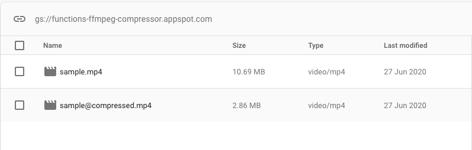

## functions-ffmpeg-compressor

This repository is a sample for video compression with Firebase Functions × ffmpeg × TypeScript.



## Setup

```bash
$ cd ./functions
$ npm install
```

## Deploy

```bash
$ npm run deploy
```

## License

[MIT licensed](./LICENSE).
